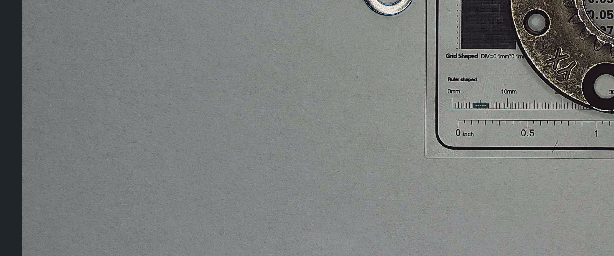

# 狗狗视觉测量 / Dog Vision Measure

一款面向 UVC 摄像头和静态图片的开源二维视觉测量软件。粗略点击目标附近即可自动寻找圆、圆心、边缘和角点，减少人工选点造成的重复性误差。

An open-source 2D visual measurement application for UVC cameras and still images. Click roughly near a target and let the software locate circles, centers, edges, and corners automatically, reducing operator-dependent measurement variation.



**操作视频 / Operation Video:** [观看或下载 / Watch or download](../../releases/latest)

## 核心特点 / Highlights

- **自动圆形测量**：点击圆附近即可自动拟合圆，直接给出直径和圆心坐标，无需手工寻找圆心。
- **同心圆与同心度**：同一区域连续检测时自动排除已测圆，可识别相邻同心圆并计算圆心偏差。
- **圆心距与圆周阵列**：在画面或测量列表中选择两个圆即可测量圆心距；选择三个圆可自动绘制阵列外接圆并给出直径，不需要人工点圆心。
- **自动比例标定**：扫描画面中的 `10/20/30/40/50/100 mm` 常见公制标尺；原示例标定板还支持微米圆组联合校验。
- **自动边缘吸附**：长度、点、角度和点到直线测量会在鼠标附近搜索清晰边缘或角点。
- **完整二维工具**：长度、角度、点坐标、点线距、折线、面积、圆、三点圆、圆弧、同心度和圆形阵列。
- **实时 UVC 画面**：可选择常见摄像头分辨率，4K 原始帧用于测量，降采样画面用于流畅预览。
- **可编辑标注**：测量完成后可拖动几何控制点与数据标签；标定线端点也可重新调整。
- **一键导出**：生成同名的带标注 PNG 截图和 CSV 测量数据，文件序号自动递增。

- **Automatic circle measurement**: click near a circle to fit it and obtain its diameter and center coordinates without manually locating the center.
- **Concentric circles and concentricity**: repeated detection excludes previously measured circles, enabling nearby concentric rings and center-offset measurement.
- **Center distance and circular arrays**: select two measured circles on the canvas or in the result list to measure their center distance; select three to draw the circumcircle through their detected centers. No manual center picking is required.
- **Automatic scale calibration**: scans for common `10/20/30/40/50/100 mm` metric rulers, with micron-circle cross-checking for the original calibration card.
- **Automatic edge snapping**: length, point, angle, and point-to-line tools search for clear nearby edges or corners.
- **Complete 2D toolset**: length, angle, point, point-to-line distance, polyline, area, circle, three-point circle, arc, concentricity, and circular array.
- **Live UVC video**: selectable camera resolutions, full-resolution frames for measurement, and downsampled previews for responsive interaction.
- **Editable annotations**: drag geometry handles and labels after measurement; calibration endpoints can also be adjusted.
- **One-click export**: writes an annotated PNG and a same-named CSV with automatically increasing sequence numbers.

## 下载免安装版 / Portable Windows Download

在 GitHub 项目页面右侧的 **Releases** 区域，或直接进入 [Releases 下载页面](../../releases)，下载最新版 Windows x64 EXE。Windows 系统无需安装，下载后双击即可直接运行，也不需要安装 Python。

Use the **Releases** section on the right side of the GitHub project page, or open the [Releases download page](../../releases), to download the latest Windows x64 EXE. It is portable: download it and double-click to run on Windows, with no installation or Python runtime required.

`v1.1.2` 精简免安装版约 46 MB，保留图片测量、UVC 摄像头、自动识别和全部二维测量功能。The compact `v1.1.2` portable build is about 46 MB and retains image measurement, UVC camera capture, automatic detection, and the complete 2D toolset.

> Windows SmartScreen may warn because the executable is not code-signed. Choose **More info / 更多信息** and verify the release source before running.

## 快速开始 / Quick Start

1. 打开图片，或选择摄像头与分辨率后连接 UVC 摄像头。
2. 点击“自动识别画面标尺”；识别不到时使用“两点划线”并输入实际长度。
3. 使用“检测圆形”，滚轮调整红色搜索环后在目标圆附近点击。
4. 可直接进入圆心距或圆阵列工具逐个点击；也可在选择工具下按住 `Ctrl`，从画面或列表选择两个/三个圆后点击对应按钮。
5. 按 `Esc` 回到选择工具，拖动黄色控制点或标签进行调整。
6. 按 `Ctrl+S` 一键导出截图和 CSV。

1. Open an image, or select a camera and resolution and connect a UVC camera.
2. Run automatic ruler calibration; if no reliable ruler is found, use two-point manual calibration and enter the real length.
3. Select circle detection, resize the red search ring with the mouse wheel, and click near the target circle.
4. Use the center-distance or array tool and click detected circles directly, or hold `Ctrl` in Select mode to choose two/three circles on the canvas or in the result list, then click the matching action.
5. Press `Esc` to return to Select, then drag yellow handles or labels to refine annotations.
6. Press `Ctrl+S` to export the annotated image and CSV together.

## 从源码运行 / Run from Source

需要 Windows 和 Python 3.11 或更高版本。双击 `start.bat` 可自动创建虚拟环境并安装依赖，也可以手动运行：

Windows and Python 3.11+ are required. Double-click `start.bat` to create the virtual environment and install dependencies automatically, or run:

```powershell
python -m pip install -r requirements.txt
python main.py
```

构建免安装 EXE 时，`build_exe.bat` 会自动使用解压到 `tools\upx-VERSION-win64` 的官方 [UPX](https://github.com/upx/upx/releases)，也可通过 `UPX_DIR` 指定目录。未找到 UPX 时仍会生成标准版，但文件更大。

When building the portable EXE, `build_exe.bat` automatically uses official [UPX](https://github.com/upx/upx/releases) extracted under `tools\upx-VERSION-win64`, or a directory specified by `UPX_DIR`. A standard, larger build is produced when UPX is unavailable.

## 常用快捷键 / Shortcuts

- `Esc`: 取消当前测量并返回选择 / cancel and return to Select
- `Ctrl+S`, `Ctrl+Shift+S`: 导出 PNG + CSV / export PNG + CSV
- `Ctrl+C`, `Ctrl+V`, `Ctrl+A`, `Delete`: 复制、粘贴、全选、删除 / copy, paste, select all, delete
- `Ctrl+Z`, `Ctrl+Y`: 撤销、重做 / undo, redo
- `V/L/A/P/D/W/G/B/Q/C/T/R/O`: 切换测量工具 / switch measurement tools

## 测量准确性 / Measurement Accuracy

这是二维平面测量软件。标尺和被测零件必须处于同一物平面；相机高度、焦距、变焦或工作平面发生变化后必须重新标定。普通 UVC 镜头存在畸变，高精度应用建议使用远心镜头、稳定照明、可溯源标定件，并用已知量块验证重复性和系统偏差。

This is a planar 2D measurement tool. The calibration reference and measured part must lie on the same plane. Recalibrate whenever camera height, focus, zoom, or the working plane changes. For high-accuracy work, use a telecentric lens, stable lighting, a traceable reference, and validate repeatability and bias with known standards.

## 技术与许可证 / Technology and License

- Python 3.11+
- PySide6 / Qt
- OpenCV
- NumPy
- MIT License

当前官方 `opencv-python` 包不包含 CUDA 算法后端。软件会检测 CUDA 能力，但默认使用 OpenCV 优化 CPU 路径。GPU acceleration requires a separately built CUDA-enabled OpenCV distribution.

## 免责声明 / Disclaimer

本项目是通用视觉测量工具，不是经过计量认证的测量仪器。请根据实际质量体系完成校准、测量系统分析与结果验证。

This project is a general-purpose visual measurement tool, not a certified metrology instrument. Calibration, measurement system analysis, and result validation remain the user's responsibility.
